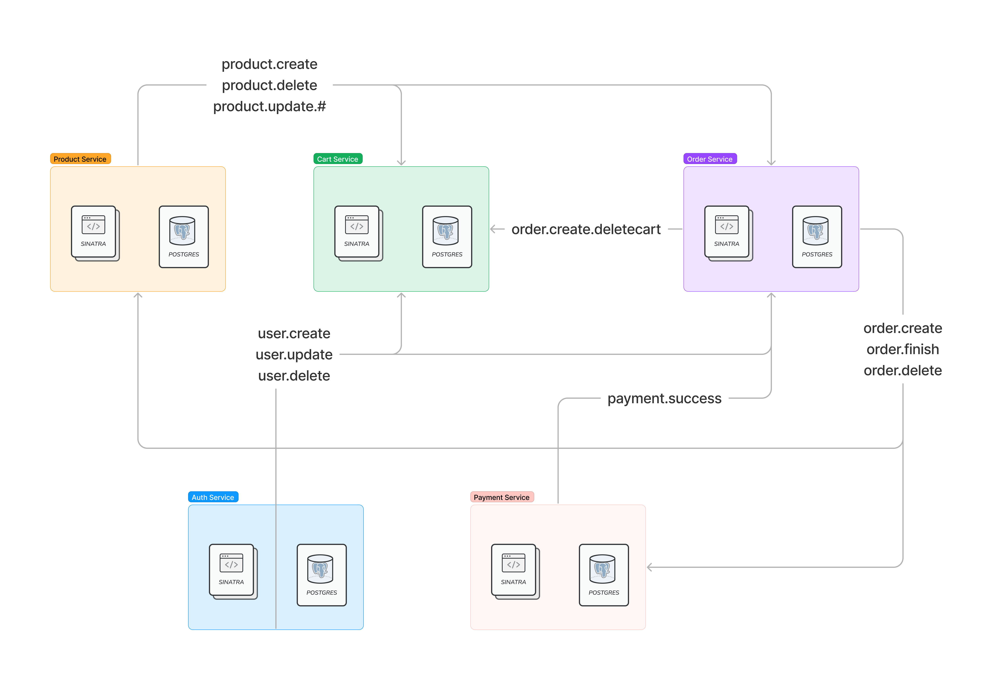
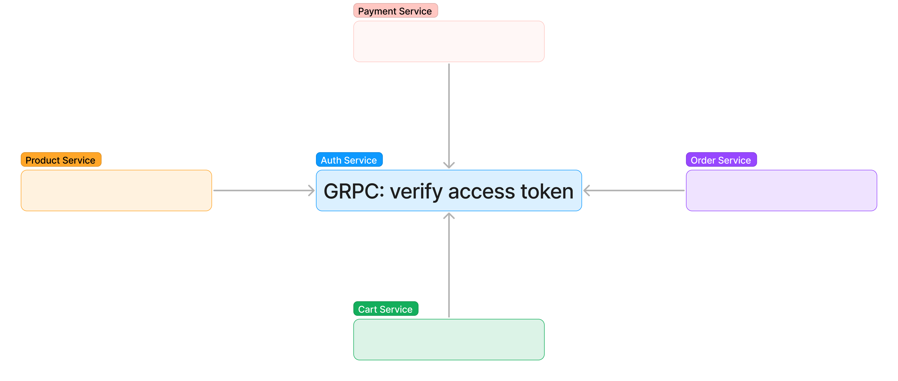

# micro-service-ecommerce-store
--- 
Simple ecommerce store app built with microservices-based architecture. Technical Stack includes golang(gin), react(nextjs, tailwindCSS), rabbitMQ, GRPC, and docker.


## Table of contents
* [Technical Stack](#technical-stack)
* [Event flow](#event-flow)
* [Authentication](#authentication)
* [How to use](#how-to-use)
* [API Endpoint](#api-endpoint)
* [Todo List](#todo)

## Technical Stack 
* [Next.js](https://nextjs.org/): Next.js enables you to create full-stack web applications by extending the latest React features, and integrating powerful Rust-based JavaScript tooling for the fastest builds.
* [TailwindCSS](https://tailwindcss.com/): A utility-first CSS framework packed with classes
* [Golang-gin](https://github.com/gin-gonic/gin): Gin is a web framework written in Go. It features a martini-like API with performance that is up to 40 times faster.
* [RabbitMQ](https://www.rabbitmq.com/): RabbitMQ is the most widely deployed open source message broker.
* [GRPC](https://grpc.io/): A high performance, open source universal RPC framework
* [Docker](https://www.docker.com/): Accelerate how you build, share, and run modern applications.

## Event flow 


## Authentication
* Token-based authentication: PASETO
* Auth Middleware: Provide access token in request header
* Refresh Token: Verify refresh token stored in http-only cookie


## How to use
***require docker and make installed***

1. git clone 

```sh
git clone https://github.com/hsingyingli/micro-service-ecommerce-store.git
cd ./micro-service-ecommerce-store
```
2. Start all the services defined in a Docker Compose file.

```sh
docker-compose up -d --build
```

3. Init required DB

***Need to wait until all database has been init (docker ps)***

```
make init_db
```

4. Testing
* Option1: Using Postman, [Endpoint](#api-endpoint)
* Option2: Open client service and start
```sh
cd ./client 
npm install 

npm run dev
# or 
npm run build 
npm run start
```

## API Endpoint
* Auth Service:
    |Method|ROUTE|
    |---|---|
    |POST|/v1/user|
    |POST |/v1/user|
    |POST |/v1/user/login|
    |POST |/v1/user/logout|
    |POST |/v1/user/renew_access|
    |GET |/v1/user/auth/m1|
    |PATCH |/v1/user/auth/me |
    |PATCH |/v1/user/auth/me/password|
    |DELETE |/v1/user/auth/me|
* Product Service:
    |Method|ROUTE|
    |---|---|
    |GET |/v1/product?id=|
    |GET |/v1/product/all|
    |GET |/v1/product/auth/all|
    |POST |/v1/product/auth|
    |DELETE |/v1/product/auth?id=|
* Cart Service:
    |Method|ROUTE|
    |---|---|
    |GET |/v1/cart|
    |POST |/v1/cart|
    |PATCH |/v1/cart|
    |DELETE |/v1/cart|
* Order Service:
    |Method|ROUTE|
    |---|---|
    |GET |/v1/order|
    |POST |/v1/order|
    |DELETE |/v1/order|
* Payment Service:
    |Method|ROUTE|
    |---|---|
    |POST |/v1/payment|


## TODO
- [x] Dev
    - [x] create Makefile
        - [x] init db

    - [x] create docker compose file
        - [x] auth service and db
        - [x] product service and db
        - [x] cart service and db
        - [x] rabbitMQ 
        - [x] declare container name

- [ ] Client
    - [x] login Page
    - [x] SignUp Page
    - [ ] Layout
        - [ ] Header
            - [x] Account Menu
            - [ ] Cart (if login      )
            - [x] Own product (if login)
    - [ ] Home Page (Practice infinite scroll)
    - [ ] Sell Page
        - [x] create product 
        - [x] list product 
        - [x] filter product
        - [ ] edit product
        - [x] delete product 
        - [x] link to product page
    - [ ] Product Page 
        

- [x] Auth Service 
    - [x] Login User API
        - [x] PASETO Token Maker
        - [x] Create Access and Refresh Token
        
    - [x] Logout User API
        - [x] Clear refresh token in cookie

    - [x] Renew Access Token

    - [x] GRPC for auth other micro service
        - [x] define proto file
        - [x] listen and serve grpc server

    - [x] Setup Rabbit MQ
        - [x] Publish User.* Message

- [x] Product Service
    - [x] Auth middleware which ask auth service for verify access token via GRPC 
    - [x] List Own product 
    - [x] delete own product
    - [x] list all product 
    - [x] Setup Rabbit MQ
        - [x] Publish Product.* Message
        - [x] Receive Order.* message from order service via rabbit MQ

- [x] Cart Service 
    - [x] Setup Rabbit MQ
        - [x] Receive User.* message from auth serivce via rabbit MQ
        - [x] Receive Product.* message from product serivce via rabbit MQ

    - [x] Create Cart API
        - [x] CRUD

- [x] Order Service
    - [x] Setup RabbitMQ
        - [x] Receive User.* message from auth service via rabbit MQ
        - [x] Receive Product.* message from auth service via rabbit MQ
        - [x] Publish Order.* message to other service
    - [x] Create Order API 
        - [x] CRUD

